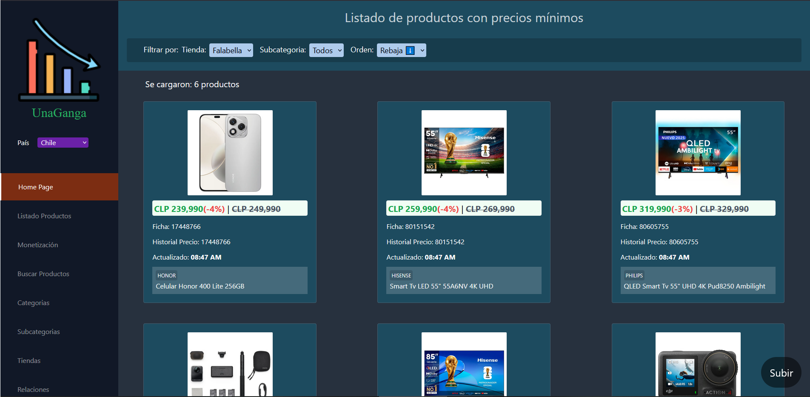
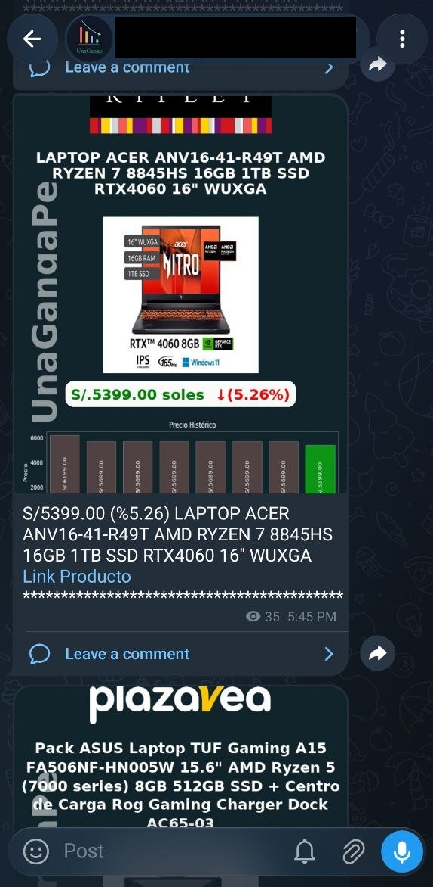
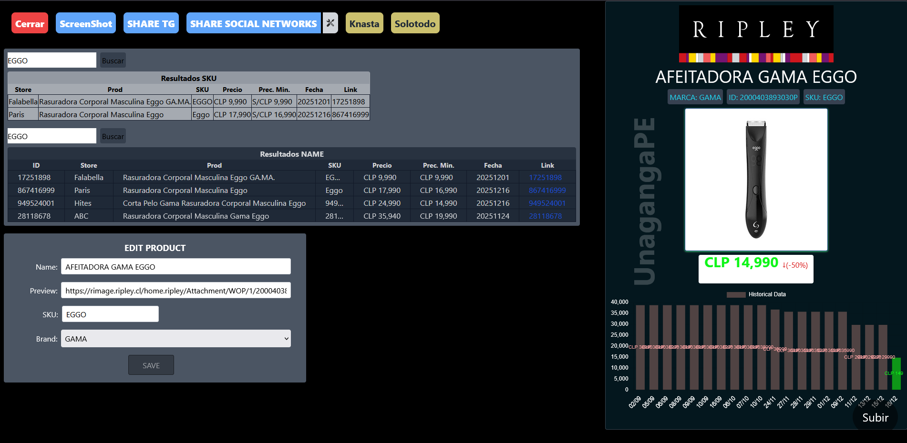

# Multi-Region E-Commerce Data Extraction & Automation Pipeline

A production-ready, highly optimized Python backend showcasing advanced web scraping techniques, asynchronous concurrency, and custom anti-bot evasion layers. This repository represents the core automation architecture of a real-world, multi-region price monitoring platform.

## 🛠️ Technical Highlights & Core Architecture

* **Advanced Browser Evasion:** Features a custom, modular wrapper for `selenium-wire` that patches environment detection variables (`navigator.webdriver`), handles Netscape cookie parsing, injects session headers, and performs headless profile camouflage.
* **Low-Level Network Interception:** Bypasses heavy DOM parsing by intercepting underlying JSON API responses via `selenium-wire`, handling raw payload encodings like `gzip` and `brotli` manually.
* **High-Performance Concurrency:** Leverages `ThreadPoolExecutor` and Python's asynchronous completion (`as_completed`) to execute non-blocking network calls and efficiently handle large-scale catalog pagination.
* **Financial Data Integrity:** Uses the standard `decimal` library (`Decimal`) instead of standard floating-point numbers to guarantee extreme precision across currency conversions, retail prices, and historical margins.

---

## 📂 Repository Structure

* **`classes/SeleniumSession.py`**: The core automation infrastructure class. Implements Python context managers (`__enter__`/`__exit__`) to secure clean browser process terminations and encapsulate stealth features.
* **`getPrices/get_with_request.py`**: A clean, highly optimized script utilizing `requests` and `BeautifulSoup4` for rapid static extraction, handling database integration placeholders, and pricing normalization.
* **`getPrices/get_with_selenium.py`**: An advanced script that combines headless browser automation with thread pool workers to map out, paginate, and parse hidden API endpoints concurrently.

---

## 🖥️ Management Dashboard & UI (Full-Stack Showcase)

To manage the ingestion of products, monitor scraping targets, and handle automated price drop notifications across Telegram and Android clients, a custom administration panel was built using **Vue.js** and **Node.js**.

*Note: The actual production application interface is deployed in Spanish for South American market operations.*

### Main Analytics & Product Management Panel

### Real-Time Alerts & Automated Command Center

---

## 🛠️ Codebase Architecture & Context

Please note that this repository contains **sanitized architecture components and code snippets** from a production environment. 

* **Dependencies & Configuration:** Internal configuration files, database models (`store_class`, `product_class`), and proprietary anti-bot bypass scripts have been intentionally omitted or obfuscated to protect intellectual property and business logic.
* **Purpose:** This code serves strictly as a **technical portfolio** to demonstrate production-grade software design, asynchronous concurrency models, database transaction logic, and clean code practices in high-performance data extraction environments.

